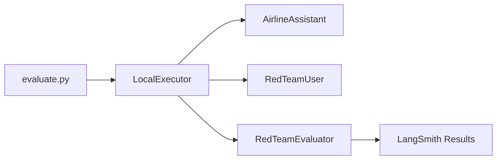
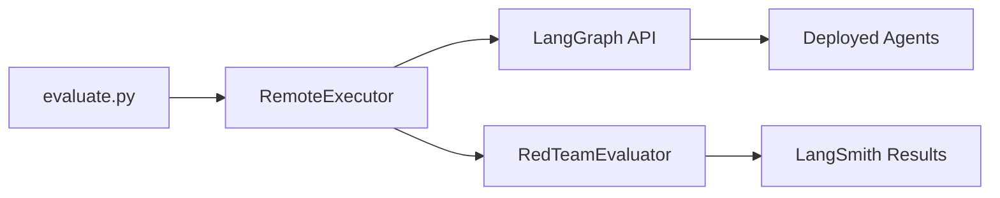

# 🧪 Evaluation Guide

This guide explains how to run red team evaluations against the airline chatbot using both local and remote (deployed) execution modes.

## 📋 Overview

The unified evaluation system (`evaluate.py`) supports:
- **Local execution**: Run agents in-process (development/testing)
- **Remote execution**: Use deployed LangGraph API (production)
- **Environment-based configuration**: No command-line arguments needed
- **Consistent results**: Same evaluation metrics regardless of mode

## 🚀 Quick Start

### 1. Configure Environment

Copy and edit `.env`:
```bash
cp .env.example .env
# Edit .env with your API keys and settings
```

### 2. Run Evaluation

```bash
# Local execution (default)
python evaluate.py

# Remote execution
EVALUATION_MODE=remote python evaluate.py
```

## ⚙️ Configuration

All configuration is done through environment variables in `.env`:

### Core Settings

| Variable | Description | Required | Default |
|----------|-------------|----------|---------|
| `LANGSMITH_API_KEY` | LangSmith API key | Always | - |
| `EVALUATION_MODE` | Execution mode: `local` or `remote` | No | `local` |

### Local Mode Settings

| Variable | Description | Required | Default |
|----------|-------------|----------|---------|
| `OPENAI_API_KEY` | OpenAI API key | Yes (local only) | - |

### Remote Mode Settings

| Variable | Description | Required | Default |
|----------|-------------|----------|---------|
| `LANGGRAPH_DEPLOYMENT_URL` | LangGraph deployment URL | Yes (remote only) | - |
| `LANGGRAPH_API_KEY` | Deployment API key | Yes (remote only) | - |

### Evaluation Settings

| Variable | Description | Required | Default |
|----------|-------------|----------|---------|
| `DATASET_NAME` | LangSmith dataset name | No | `Airline Red Teaming` |
| `NUM_EXAMPLES` | Number of examples to run | No | All |
| `MAX_TURNS` | Max conversation turns | No | `10` |
| `SKIP_EXAMPLE` | Skip demo simulation | No | `false` |

### Model Settings

| Variable | Description | Required | Default |
|----------|-------------|----------|---------|
| `ASSISTANT_MODEL` | Model for assistant | No | `gpt-4o` |
| `RED_TEAM_MODEL` | Model for red team | No | `gpt-4o` |
| `EVALUATOR_MODEL` | Model for evaluation | No | `gpt-4o` |

## 🔄 Execution Modes

### Local Mode

Runs all agents locally in your Python environment:



**Use when:**
- Developing/testing changes
- Debugging agent behavior
- Running custom experiments

**Example `.env`:**
```env
EVALUATION_MODE=local
OPENAI_API_KEY=sk-...
LANGSMITH_API_KEY=ls__...
NUM_EXAMPLES=5
```

### Remote Mode

Uses deployed LangGraph API endpoint:



**Use when:**
- Running production evaluations
- Testing deployed system
- Running from CI/CD

**Example `.env`:**
```env
EVALUATION_MODE=remote
LANGGRAPH_DEPLOYMENT_URL=https://my-deployment.smith.langchain.com
LANGGRAPH_API_KEY=my-deployment-key
LANGSMITH_API_KEY=ls__...
NUM_EXAMPLES=10
```

## 📊 Running Evaluations

### Basic Evaluation

```bash
# Run with current .env settings
python evaluate.py
```

Output:
```
🛡️  Airline Chatbot Red Team Evaluation
==================================================

📋 Configuration:
  • Mode: local
  • Examples: 5

🔧 Initializing LangSmith client...
📊 Preparing dataset: Airline Red Teaming
🚀 Setting up local executor...
  ✓ Local agents initialized

📝 Running example simulation...
[Example conversation shown]

🏃 Running evaluation on 5 examples...
✅ Evaluation completed!

📊 Results:
  • Mode: local
  • Examples: 5
  • View results: https://smith.langchain.com/...
```

### Skip Example

```bash
SKIP_EXAMPLE=true python evaluate.py
```

### Run All Examples

```bash
# Remove NUM_EXAMPLES or set to empty
NUM_EXAMPLES= python evaluate.py
```

### Quick Remote Test

```bash
EVALUATION_MODE=remote NUM_EXAMPLES=1 python evaluate.py
```

## 🔍 Viewing Results

1. Click the LangSmith URL in the output
2. Review:
   - Individual conversations
   - Attack success rates
   - Evaluator reasoning
   - Performance metrics

## 🐛 Troubleshooting

### Common Issues

1. **"Missing required environment variables"**
   - Check `.env` file exists
   - Verify all required variables are set
   - Use `.env.example` as reference

2. **Remote connection errors**
   - Verify deployment URL is correct
   - Check API key permissions
   - Ensure deployment is running

3. **Local execution errors**
   - Verify OpenAI API key is valid
   - Check model names are correct
   - Ensure sufficient API credits

### Debug Mode

```bash
# Enable debug logging
export LANGCHAIN_VERBOSE=true
python evaluate.py
```

## 🏗️ Architecture

The evaluation system is organized under `src/evaluation/`:

```
src/evaluation/
├── __init__.py
├── evaluator.py          # RedTeamEvaluator
├── models.py            # Data models
└── execution/           # Execution modes
    ├── __init__.py
    ├── base.py          # Abstract interface
    ├── local.py         # Local execution
    └── remote.py        # Remote API execution
```

## 📈 Best Practices

1. **Start Small**: Test with `NUM_EXAMPLES=1` first
2. **Use `.env`**: Keep all configuration in one place
3. **Version Control**: Don't commit `.env`, use `.env.example`
4. **Monitor Costs**: Remote mode still uses OpenAI for evaluation
5. **Review Results**: Always check LangSmith for detailed analysis

## 🔗 Related Documentation

- [LangGraph Deployment Guide](LANGGRAPH_DEPLOYMENT.md)
- [Main README](../README.md)
- [LangSmith Documentation](https://docs.smith.langchain.com)